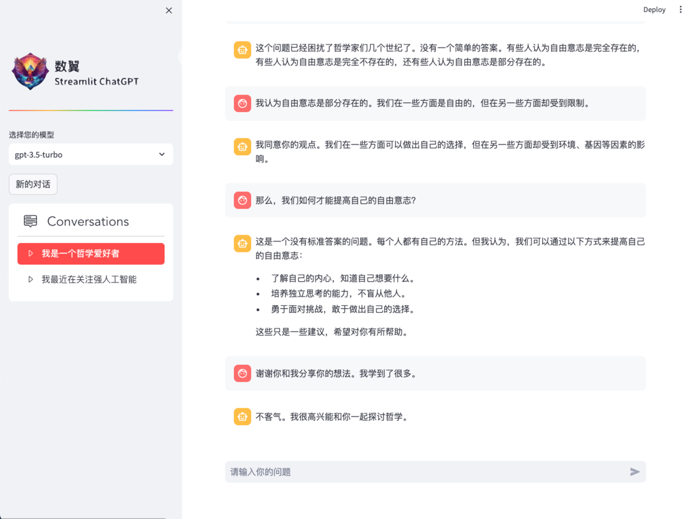

## Streamlit-ChatGPT: A ChatGPT-like app built with Streamlit



This project is a simple ChatGPT-like app built with Streamlit. 

It uses the ChatGPT API to generate text, translate languages, 
write different kinds of creative content, 
and answer your questions in an informative way.


## How to use

1. Clone the repository to your local machine.
```shell
git clone https://github.com/iDigitalWings/streamlit-chatgpt.git
cd streamlit-chatgpt
```
2. Install the dependencies with pip install -r requirements.txt.
```shell
pip install -r requirements.txt
```
3. Run the app with streamlit run app.py. 

```shell
streamlit run app.py
```

## Contributing

Contributions are welcome! Please open an issue or submit a pull request if you have any suggestions or improvements.

## License

This project is licensed under the MIT License.

## More


